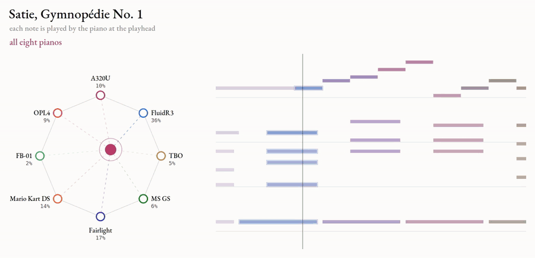
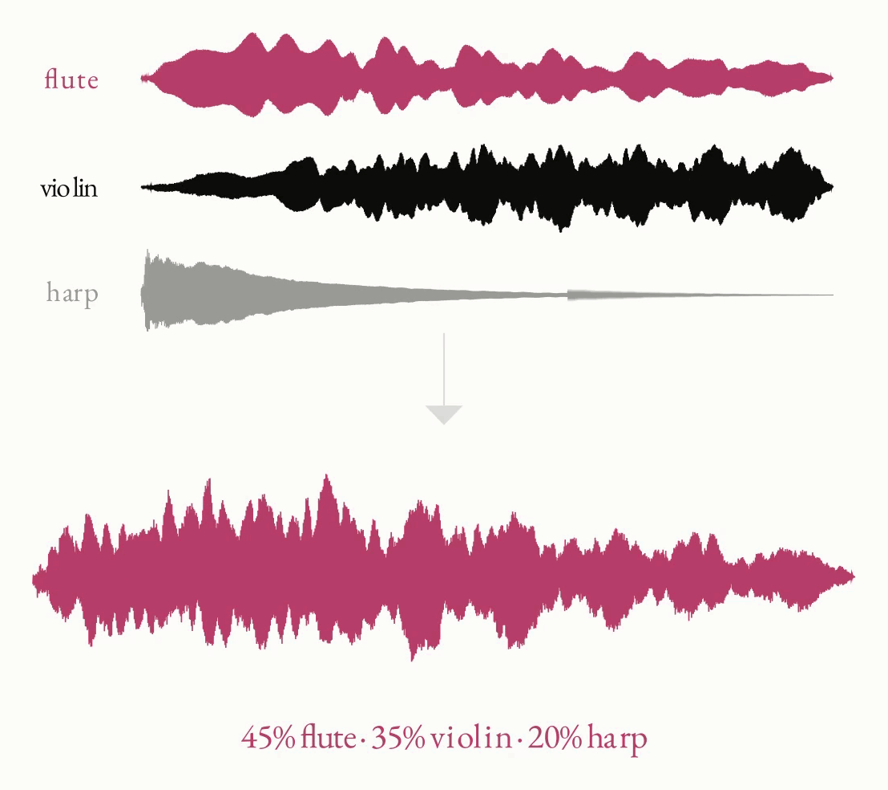
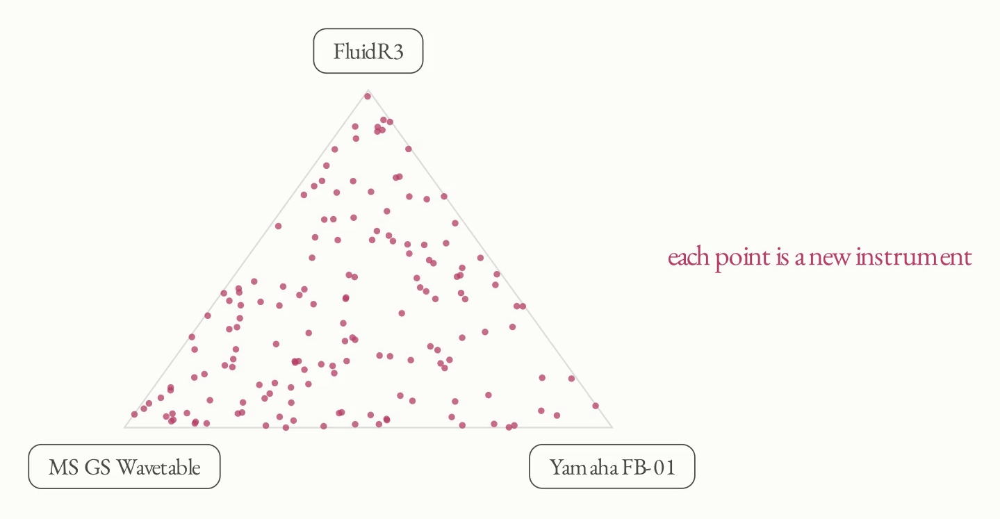
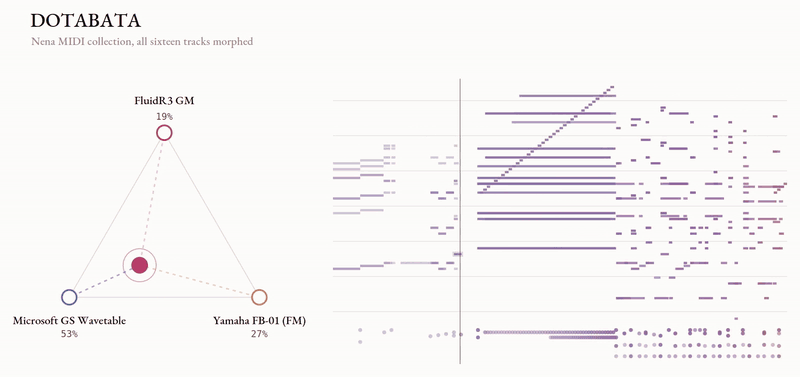
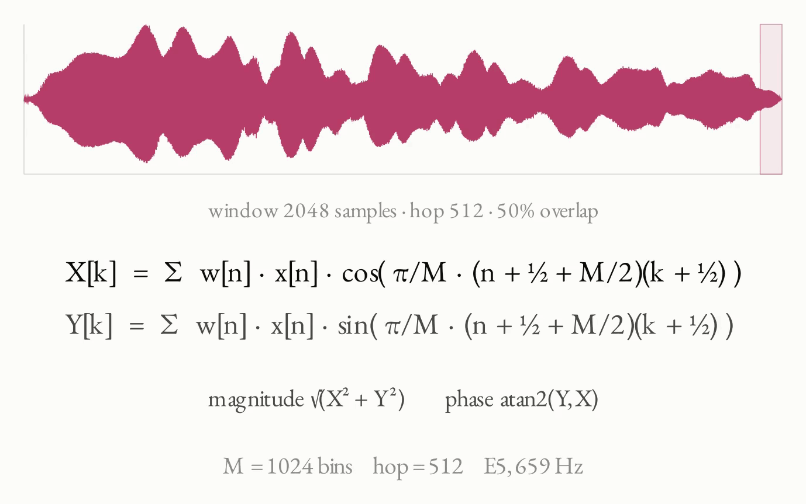
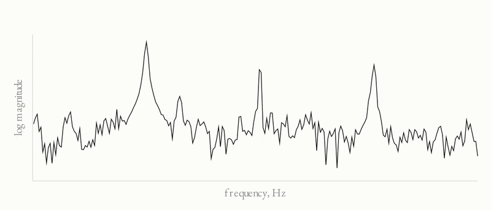
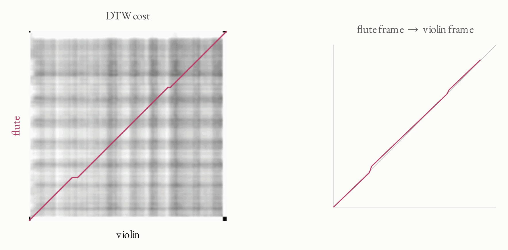
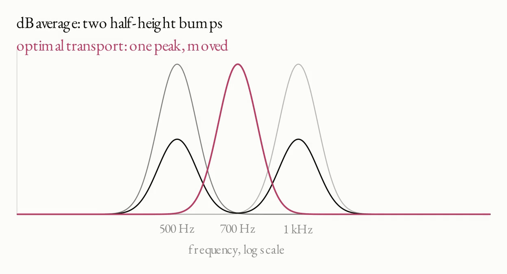
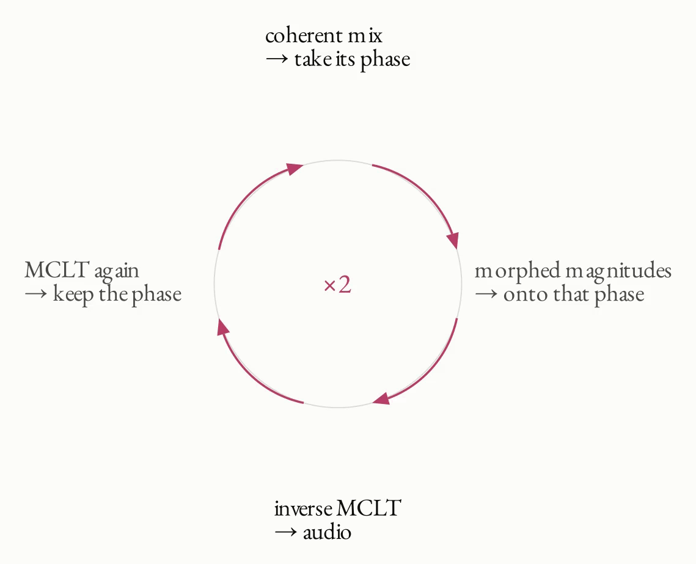
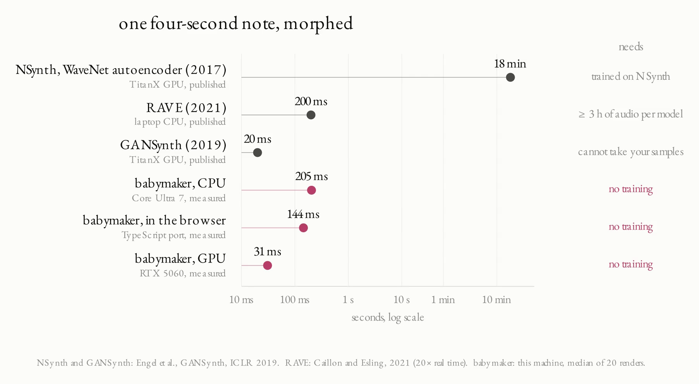

# babymaker

<p align="center">
  
</p>

It takes the same note from a few instruments and makes a new instrument from them. It is not a crossfade. For instance, the attack, the tone and the decay of the new note could each be part flute, part violin and part harp. With three sources the playhead moves around a triangle, and with more it moves around a bigger shape.

<p align="center">
  
</p>

I made it for training data. My transcription models learn from MIDI rendered through soundfonts, and there are only so many soundfonts. I think a model could end up learning those exact pianos instead of what a piano sounds like in general. Mixing them gives way more timbres without recording anything.

<p align="center">
  
</p>

There is a blog post with the demo and a video explaining it [here](https://kobi.music/research/making-soundfont-babies).

## Parts

- `babymaker/` is the Python library and CLI
- `web/lib/babymaker/` is the TypeScript version that the demo runs
- `web/` is the browser demo
- `video/` makes the videos (see `video/README.md`)

## Demo

```bash
cd web
npm install
npm run dev
```

Click the stage to load the instruments, then drag the pink dot around while Alla Turca plays. Click a dot to swap its instrument. `npm run build` makes a static site in `web/dist/`.

<p align="center">
  
</p>

The six instruments are from the Sonatina Symphonic Orchestra. `tools/prep-babies.py` rebuilds them from the SSO samples.

## Python

```bash
pip install -e ".[fast]"
```

Add `[gpu]` for the torch/CUDA backend. A 50/50 morph of the FluidR3 and A320U pianos at C4:

```bash
python3 -m babymaker render --src FluidR3_GM.sf2:0:0 --src A320U.sf2:0:0 \
    --key 60 --weights 0.5,0.5 --out baby.wav
```

A source is `font.sf2:bank:preset` or a `.wav` file. `grid` renders every point of a triangle and `random` renders random weights. `--set key=value` changes any field of `MorphConfig`. The soundfont renderer in `render/` builds itself the first time it is needed.

```python
from babymaker import Morpher, MorphConfig, load_source
srcs = [load_source(s, 44100, key=60) for s in ("A.sf2:0:0", "B.sf2:0:0", "C.wav:C4")]
mp = Morpher(srcs, MorphConfig(sr=44100))   # the analysis happens once
y = mp.render([0.2, 0.3, 0.5])              # then any weights are cheap
```

## Playing a MIDI File

`babymaker/arrange.py` plays a whole MIDI file where each instrument is a baby of a few soundfonts. The weights can move while it plays. A plan file names the MIDI, the fonts and the path the playhead takes (the format is at the top of `arrange.py`).

```bash
python3 -m babymaker.arrange video/plans/pianos_long.json
```

<p align="center">
  
</p>

## How It Works

Each note gets broken down by its level, its envelope, its fine structure and its timing. I average each of those differently, then build the new note from them.

**Transform.** The audio is cut in overlapping frames. Each frame goes through the MCLT (an MDCT and an MDST), so each bin has a magnitude and a phase. It can rebuild the original signal exactly.

<p align="center">
  
</p>

**Analysis.** The level is how loud the frame is in dB. The envelope is the smooth curve the harmonics sit on. I find it with iterated cepstral smoothing (the true envelope from Röbel and Rodet). The fine structure is what is left, which is the harmonics and the noise between them.

<p align="center">
  
</p>

**Align.** The notes are not the same length, so each source is warped onto the first source with DTW. The warp is smoothed so it never jumps, and it leaves the attack alone.

<p align="center">
  
</p>

**Average.** The level is averaged in dB, so the decay rates get averaged too. The fine structure is averaged as amplitude to the power of 0.6. In Python, the formant part of the envelope uses optimal transport. A peak at 500 Hz and a peak at 1 kHz meet at 700 Hz instead of turning into two half-height bumps.

<p align="center">
  
</p>

**Resynthesis.** There is no phase yet, and a made-up phase turns a note into mush. So each source is warped in the time domain with WSOLA and the sources are mixed. The mix gives the phase and the model gives the magnitudes. A few rounds of Griffin-Lim make them agree. The attacks come from the recordings themselves, so they stay sharp.

<p align="center">
  
</p>

## In the Browser

`web/lib/babymaker/` is `morph.py` rewritten in TypeScript, and it runs in a Web Worker. It skips the optimal transport step and averages the envelope in dB. That step is the next thing I want to add. It is checked against Python renders in `reference/`, and all ten random mixes match at a correlation of 1.0000.

## Speed

A morph of three 3.5 s notes:

| | laptop (Ryzen 8845HS) | desktop (Core Ultra 265K) | RTX 5060 |
|---|---|---|---|
| analysis | 0.5 s | 0.35 s | 0.03 s |
| render | 0.27 s | 0.13 s | 0.008 s |

The GPU backend (`gpu.py`) is used when torch finds CUDA. `--device cpu` forces numpy.

<p align="center">
  
</p>

## Tests

```bash
python3 -m pytest tests/test_babymaker.py -q
cd web && npm test
```

The sf2 test needs FluidR3_GM and TimGM6mb in `/usr/share/sounds/sf2`.

## Limits

- Mono only.
- One morph per key. Sources should be within an octave or so of the key.
- Drums and noise get no pitch correction.
- Very different instruments still leave a bit of error on partials that do not line up.

## Credits

- Samples: [Sonatina Symphonic Orchestra](https://github.com/peastman/sso) by Mattias Westlund, CC Sampling Plus 1.0
- `render/tsf.h`: [TinySoundFont](https://github.com/schellingb/TinySoundFont) by Bernhard Schelling, MIT
- True envelope: A. Röbel and X. Rodet, "Efficient spectral envelope estimation and its application to pitch shifting and envelope preservation", DAFx 2005
- `alla-turca.mid`: a loop from Mozart's Rondo alla Turca (K. 331)
